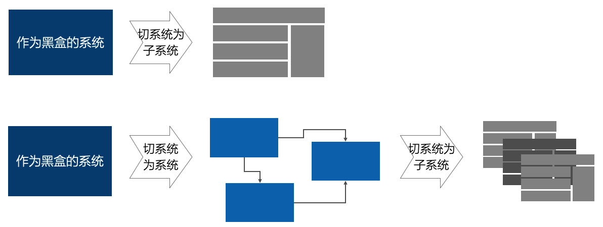
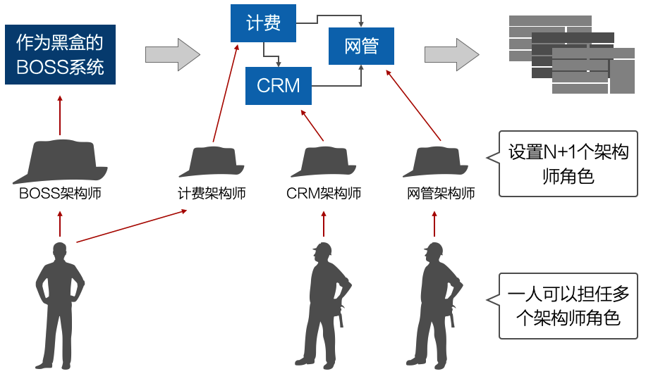

# 9.1. 高层分割的两种实践套路

- 切系统为系统
- 切系统为子系统

在实践中，经常出现这两种方式。虽然从理论上，设计是层层嵌套展开的--即“每一级的子系统”对“下一级的子系统”而言都是系统，都可以单独定义需求和进行设计。但这里更强调“两种套路”的思维。

也就是说：

- 要么告诉自己：我面对的是1个“系统的系统(`System of Systems`)”
- 要么告诉自己：我要把这个“原子系统”切成若干子系统

## 9.1.1. 切系统为系统

