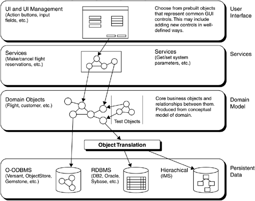
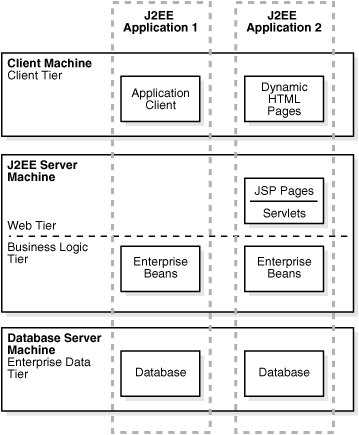

# 9.2. 分层式概念服务架构

人们常说，“分层式最流行的架构模式”。从字面上理解，这似乎意味着大家所进行的“分层”在思想层面上是一致的。但事实并非如此。在实践中，分层有不同的角度，并且互不矛盾。通常会总结为“3 + 1”流派。

- `Layer`：逻辑层
- `Tier`：物理层
- 按通用性分层
- 技术堆叠

## 9.2.1. Layer:逻辑层

逻辑层(`Layer`)重视职责的划分，职责之间常常是上层使用下层的关系--但是根本不关心上层和下层是否“能分布”在不同机器上。

> 图片来源：[Layered Business Architectures: Logical Structures](https://flylib.com/books/en/1.243.1.93/1/)

- 图中的`Services`层对下层`Domain Model`部分的访问，是一种跨机器的远程访问吗？

答案是：不知道，也不关心。整个架构图中的箭头表示的是逻辑上服务使用关系，而对物理角度是否是跨机器的访问方式并不关心。

按`Layer`分层 ≠ 按`Tier`分层。

- 图中的`User Interface`、`Services`、`Domain Model`和`Persistent Data`是通用性逐渐增加吗？（”通用性越大，所处层次就越靠下“是按通用性分层的常见方式。）

答案是：无法确定那一层更通用。例如，作为最下层的`Persistent Data`层本来支持硬盘，但后来要支持磁盘阵列，再后来要支持`SAN`（存储区域网络），这都要求存`Persistent Data`层要有针对性的进行改变。

按`Layer`分层 ≠ 按通用性分层。

## 9.2.2. Tier: 物理层

物理层(`Tier`)指”能分布“在不同机器上的软件单元，不同的物理层之间必须有跨机器访问的能力--可以通过远程调用、或通讯协议等方式。

> 图片来源：[Oracle Application Server Containers for J2EE](https://docs.oracle.com/cd/B14098_01/core.1012/b13994/webstapp.htm#BCECCIJC)

关于`Tier`这种分层方式， 最需要强调的是，几层(`Tier`)架构是看”能分布“的能力，不是看”实际部署情况“。

> 我们常说的`Java EE`应该是`N-Layer`的，因为从逻辑上来看，`Java EE`里面有表现层、业务逻辑层和数据持久层。从物理上而言，这3层可以在不同的`Tier`上（表现层在PC上，业务逻辑层在应用服务器上，数据持久层在数据库服务器上），也可以在一个`Tier`上，比如`Martin`说过，如果把数据库、应用服务器和浏览器都装在一台电脑上，那么`3-layer`就在`1-tier`上了。

这段话问题不小。

毕竟，”`N-Tiers`架构“的一大好处是可伸缩性--业务量小的时候将`N`个`Tier`都部署在同一台机器上 ，等业务量大的时候再为每个`Tier`单独安排一台或一组机器，这恰恰是"`N-Tiers`架构"的目标！所以，一个系统如果架构设计时是”`4-Tiers`架构“的，并且开发时也实现了这一点，那么把它们部署在同一台机器上并没有改变”`4-Tiers`架构“。最终，工程师的实际部署方案觉得了系统是几层(`Tier`)架构，这未免荒唐。

其实，总结出”3级“映射关系（而不是”两级“）就清楚了：

> 逻辑层`Layer` -> 物理层`Tier` -> 一台或一组计算机

关于按`Tier`分层 ，再看一例：微软的`Azure`虚拟网络系统，很明确的进行了不同的`tier`的划分，各层之间必然是能以进行跨机器方式的协议互相通讯的（只不过每个`Tier`的部署规模比较大罢了）。

> 图片来源：[Azure中具有Apache Cassandra的Linux多層式架構 (N-tier) 應用程式](https://docs.microsoft.com/zh-tw/azure/architecture/reference-architectures/n-tier/n-tier-cassandra)
