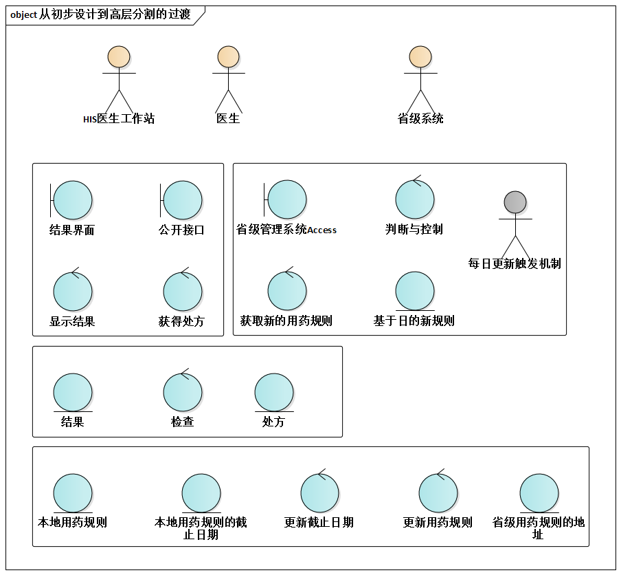
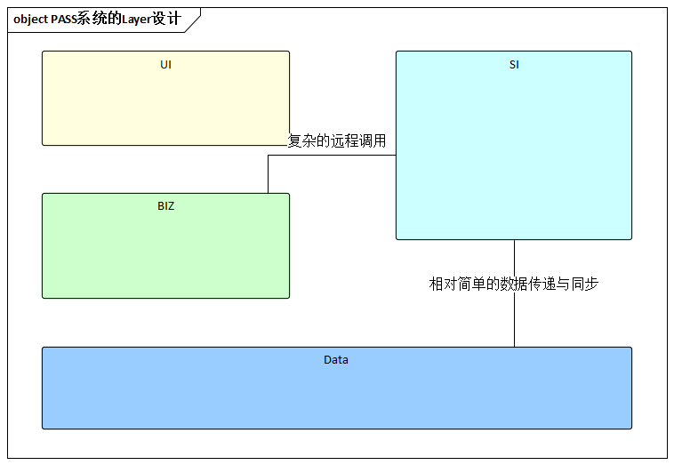
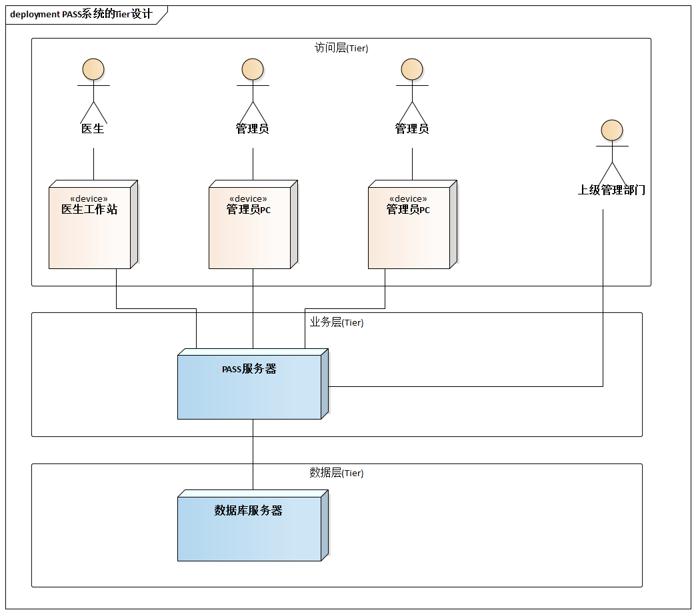
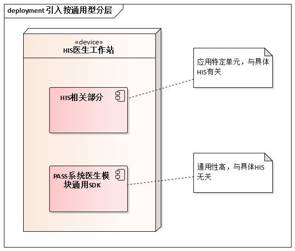

# 9.4. 贯穿案例

继续`PASS`系统的贯穿案例。

由于`PASS`系统的分布式特点明显，所以高层分割除了考虑常见的`Layer`方式之外，我们也考虑`Tier`。而通过主动考虑“按通用性分层”，我们也大有收获--确定引入“`PASS`医生模块通用`SDK`”而使无谓的重复开发工作量降至最低。

## 9.4.1. 从初步设计到高层分割的过渡

我们在之前完成了[初步设计成果](/ch8/8.4.md)，通过对这些已发现的职责进行“综合”，可以确定系统基本的高层分割方式。

## 9.4.2. PASS系统Layer设计

于是，可以得到按`Layer`对`PASS`系统进行高层分割的方式。

## 9.4.3. PASS系统之Tier设计

按`Layer`切分为反应`PASS`系统很强的分布式特点，我们应进一步从`Tier`角度考虑`PASS`系统的高层分割方式。

## 9.4.4. 引入通用性分层

如果进一步质疑“可重用性”，应将嵌入HIS的程序进一步切分--分出“PASS系统医生模块通用SDK”，它和任何具体HIS无关，所以通用性高，应分离出去。

